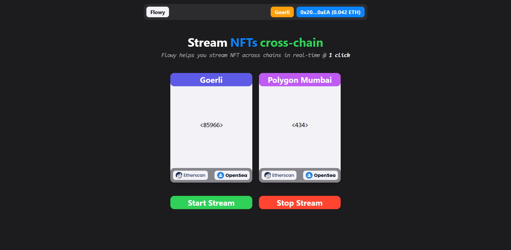

  
   <h1>Flowy -- Stream NFTs across chains in real-time @ 1 click</h1>
  
  

    <a href="https://flowynft.vercel.app/">See Live Website</a>
    |
    <a href="https://ethglobal.com/showcase/flowy-810ya">View Hack Submission</a>
     
    <b>If you like this project, don't forget to give it a star!   Thanks! 😊</b>
  

## What it does?

-   With Flowy, you can **stream** NFTs `across` chains in real-time.
-   _For instance_ -- send + change a number `automagically` from one chain to another @ **_each second_** _literally_.

## How it works?

> Using some **smart contract magic** _(wink, wink)_

-   Flowy’s smart contract has **dynamic** `token URI` _(stored as on-chain function)_
-   Deployed **across** `EVM` chains _(currently Goerli + Polygon Mumbai)_
-   Basically, NFT is **changed** on a `per second` basis -- **_aka streaming_**

## How it's made?

> Using **Connext** + **Push Protocol** + **Smart Contracts**

-   Data is streamed by passing a `stream reference` _(linked with block timestamp)_
-   **Stream Reference** changes `token URI` as per set time interval _(currently 1 second)_
-   Flowy’s `smart contact` **co-ordinates** with chains to ensure a `seamless` flow

## Future Work

-   _Link data to colors (RGB + more)_
-   _Add nested update feedback_
-   _Simultaneous Chain Support_

### `Disclaimer` -- **_List of all deployments I made to make this work :)_**

#### `Test 1` -> Hello World!

-   **Optimism** -- [0x199F32709630345d701Ec3d072eC816cab33f2f5](https://goerli-optimism.etherscan.io/address/0x199F32709630345d701Ec3d072eC816cab33f2f5)

#### `Test 2` -> TOKENS MISSING -- Tokens were sent from Mumbai Testnet, but they didn't reach Goerli -- if you find them, please send them @ 0x20136F73c536Db9D061b078146D7694cd4Bd0aEA address.

-   **Optimism** -- [0xEBDe845A1b3496e8Bac65b12A666E09C13ae1cC4](https://goerli-optimism.etherscan.io/address/0xEBDe845A1b3496e8Bac65b12A666E09C13ae1cC4)
-   **Mumbai** -- [0x6521CBd89b00B05c74D5CCa6EBA313E2fcC5bBa7](https://mumbai.polygonscan.com/address/0x6521CBd89b00B05c74D5CCa6EBA313E2fcC5bBa7)

#### `Test 3` -> CONNEXT WORKED -- now, I need to focus on how to actually stream NFT, fr.

-   **Optimism** -- [0x7bD14F022b13D0d49bC1b9d2F6d4b9E522f73220](https://goerli-optimism.etherscan.io/address/0x7bD14F022b13D0d49bC1b9d2F6d4b9E522f73220)
-   **Mumbai** -- [0x313daf6A19669353a331AE47e5D625aC5A2b0413](https://mumbai.polygonscan.com/address/0x313daf6A19669353a331AE47e5D625aC5A2b0413)

#### `Test 4` -> SOMETHING WORKED -- basically data was being sent + received.

-   **Optimism** -- [0x10618819DDbECAa8c41614B8E84B5d84FacA8980](https://goerli-optimism.etherscan.io/address/0x10618819DDbECAa8c41614B8E84B5d84FacA8980)
-   **Mumbai** -- [0x99573EaebdbA8B8f7245a424ef60BAA30ae142AE](https://mumbai.polygonscan.com/address/0x99573EaebdbA8B8f7245a424ef60BAA30ae142AE)

#### `Test 5` -> 404 -- don't know what happened here.

-   **Optimism** -- [0x9FF4F30AF7F5E09d8fe1732002ce541b37456Ad2](https://goerli-optimism.etherscan.io/address/0x9FF4F30AF7F5E09d8fe1732002ce541b37456Ad2)
-   **Mumbai** -- [0x3F1DD9E63820BBB5F891491DB09164e6B90719EB](https://mumbai.polygonscan.com/address/0x3F1DD9E63820BBB5F891491DB09164e6B90719EB)

#### `Test 6` -> SOMETHING COOL JUST HAPPENED -- ain't gonna reveal here the suspense here, check out the code :)

-   **Mumbai** -- [0x8F188C69F7a368d2eFeab4F48becFc7134cd398E](https://mumbai.polygonscan.com/address/0x8F188C69F7a368d2eFeab4F48becFc7134cd398E)

#### `Test 7` -> TOKENS MISSING PART 2 -- back to the same problem of Test#2, damn.

-   **Optimism** -- [0x58c173Cb71EB14f40997A209e3dA004Fd85eaB9B](https://goerli-optimism.etherscan.io/address/0x58c173Cb71EB14f40997A209e3dA004Fd85eaB9B)
-   **Mumbai** -- [0x2A74C6a761FE076585664678fbAF2A233510f102](https://mumbai.polygonscan.com/address/0x2A74C6a761FE076585664678fbAF2A233510f102)

#### `Test 8` -> MYSTERY SOLVED -- it was the authorization problem in contract.

-   **Mumbai** -- [0xb460582cD86d379eAC0a8dF9E3a0D33AE445aD0D](https://mumbai.polygonscan.com/address/0xb460582cD86d379eAC0a8dF9E3a0D33AE445aD0D)

#### `Test 9` -> TOKENS MISSING PART 3 -- it was not the authorization problem.

-   **Optimism** -- [0xaA2E1F629619cADf34ba2e78cEd8dD348ad9f399](https://goerli-optimism.etherscan.io/address/0xaA2E1F629619cADf34ba2e78cEd8dD348ad9f399)
-   **Mumbai** -- [0xD387157e10EF1B772E7e207466BB9f1dA46FD0D7](https://mumbai.polygonscan.com/address/0xD387157e10EF1B772E7e207466BB9f1dA46FD0D7)

#### `Test 10` -> TOKENS MISSING PART 4 -- at this point, I was about to give up, but I didn't -- not gonna let that damn TEST token decide the fate of this project.

-   **Optimism** -- [0x00bc4406ED97643FD98eE7b65D2a17e339eF3B1f](https://goerli-optimism.etherscan.io/address/0x00bc4406ED97643FD98eE7b65D2a17e339eF3B1f)
-   **Mumbai** -- [0xDD7bB344dA9793da270d55ccDb3a192F72D51947](https://mumbai.polygonscan.com/address/0xDD7bB344dA9793da270d55ccDb3a192F72D51947)

#### `Test 11` -> DAMN! -- it was the problem of Connext's bridges; if you send token from Polygon to Optimism, then they go missing (something fishy going on with Connext's bridge on Polygon) -- but if you send from Optimism to Polygon, it works.

-   **Optimism** -- [0x29022Ef6818CD2e2A70a10B278695BD555ba8b1b](https://goerli-optimism.etherscan.io/address/0x29022Ef6818CD2e2A70a10B278695BD555ba8b1b)
-   **Mumbai** -- [0xEA32B11df38BeeBB3f22c81a46eB8D07FaeB284B](https://mumbai.polygonscan.com/address/0xEA32B11df38BeeBB3f22c81a46eB8D07FaeB284B)

#### `Test 12` -> PIVOT -- moved to Goerli (coz' Optimism betrayed me) + added Push Protocol

-   **Goerli** -- [0xfF44095dcc42205c49D6d317056853D08c9B451c](https://goerli.etherscan.io/address/0xfF44095dcc42205c49D6d317056853D08c9B451c)
-   **Mumbai** -- [0x23aA8D82Befb7EA722F2EbE461c6F5A3FaB7652b](https://mumbai.polygonscan.com/address/0x23aA8D82Befb7EA722F2EbE461c6F5A3FaB7652b)

#### `Test 13` -> TESTING -- notifications are working, we are good for launch -- cap'n

-   **Mumbai** -- [0x10a0358e48D56Dcc38A0047Ce834e02834B4bb16](https://mumbai.polygonscan.com/address/0x10a0358e48D56Dcc38A0047Ce834e02834B4bb16)

#### `Test 14` -> NOTIFICATION MISSING -- when stream was sent -> notification was received BUT when stream was received -> notification was not received, huh.

-   **Goerli** -- [0x1ec713728479B84Af6038DE2aA9cfE666c0B2725](https://goerli.etherscan.io/address/0x1ec713728479B84Af6038DE2aA9cfE666c0B2725)
-   **Mumbai** -- [0xE13439d4a9B2279F406a0bC40Cc491B5602692B0](https://mumbai.polygonscan.com/address/0xE13439d4a9B2279F406a0bC40Cc491B5602692B0)

#### `Test 15` -> EUREKA! -- everything works, FINALLY!

-   **Goerli** -- [0x6C7132d30167F39Ef6DA9287916d09A5962b8E51](https://goerli.etherscan.io/address/0x6C7132d30167F39Ef6DA9287916d09A5962b8E51)
-   **Mumbai** -- [0x0029754f88896E3FE639Dad25c1460223231F032](https://mumbai.polygonscan.com/address/0x0029754f88896E3FE639Dad25c1460223231F032)

> _Built @ **Scaling Ethereum Hackathon** by **[me](https://twitter.com/yupuday)** :)_
